# OperationsNABH - End-to-End Business Rules, SRS, and LLD (Spring Boot + React)

## 1. Purpose

This document is the implementation blueprint for modernizing OperationsNABH from Struts/Hibernate/JSP to Spring Boot + React **without changing business behavior**.

It provides:
- immutable business rules
- complete SRS (functional and non-functional)
- end-to-end LLD for backend and frontend
- SQL catalog aligned to rule execution
- class diagrams per business module
- UI -> API -> Service -> DB traceability

## 2. Non-Negotiable Modernization Guardrails

1. Business outcomes, validations, transitions, calculations, and file behaviors must remain unchanged.
2. DB-driven workflow and lookup semantics remain source-of-truth (`ehfm_workflow`, `ehfm_cmb_dtls`, related masters).
3. Existing configuration keys and precedence (`properties/*.properties`) must be preserved.
4. Cache may optimize read latency but must not alter decisions.
5. Every state transition must be auditable.

## 3. Source-of-Truth Artifacts (Analyzed)

- `MIGRATION_PLAN.md`
- `README.md`
- `WebContent/struts-config.xml`
- `WebContent/WEB-INF/applicationContext.xml`
- `properties/commonConfigurationContext.xml`
- `properties/commonPersistenceContext.xml`
- `properties/hibernate.db.properties`
- `properties/ApplicationResources.properties`
- `properties/Claims.properties`
- `properties/FollowUp.properties`
- `properties/Registration.properties`
- `properties/SGVConstants.properties`
- `src/com/ahct/**` actions/services/daos/models
- `db/Schema_Table_Details.xlsx`

## 4. Legacy Domain and Route Inventory (Modernization Inputs)

### 4.1 Struts Actions (Legacy Entry Points)

`/loginAction`, `/ChangePwdReq`, `/empHistory`, `/casesSearchAction`, `/ClaimsFlow`, `/updateProfile`, `/attachmentAction`, `/followUpAction`, `/ceoWorklist`, `/trainingMaterialsAction`, `/casesApprovalAction`, `/clinicalNotesAction`, `/createEmployee`, `/preauthDetails`, `/patientDetails`, `/patientDetailsNew`, `/vendorActionNew`, `/panelDocPay`, `/medicalAudit`, `/telephonicAction`, `/digitalCertificate`, `/flaggingAction`, `/annualCheckUpAction`, `/ahcClaimsAction`, `/chronicAction`, `/adminSanction`, `/CeoWorkListAction`, `/schedulersAction`, `/cardSearchAction`, `/bioMetricAction`, `/tokenAction`, `/aadhaarVerification`

### 4.2 Major Legacy Modules

- Login / authentication
- Patient registration and enrollment
- Card search + photo retrieval
- Case search + workflow actions
- Preauthorization
- Claims processing
- Follow-up claims
- Attachments
- Panel doctor payments
- Medical audit + flagging
- Chronic OP
- Annual checkup
- CEO/admin sanction
- Biometric + telephonic registration
- Scheduler jobs

## 5. End-to-End Workflow (Business Canonical)

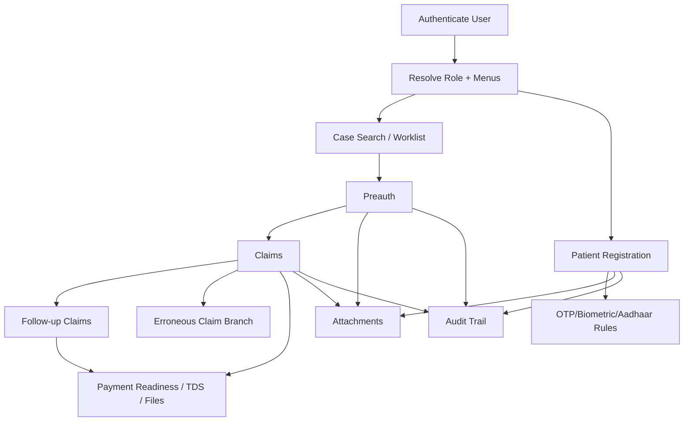

## 6. Immutable Business Rule Catalog (Rule IDs)

## 6.1 Authentication and Session Rules

- **BR-AUTH-01**: If LDAP/OpenAM flag is enabled, external auth path is attempted; fallback/local mode behavior must preserve legacy semantics.
- **BR-AUTH-02**: Session inactivity timeout is driven by `MAX_INACTIVE_INTERVAL`.
- **BR-AUTH-03**: Password change enforces alphabet + numeric + special character + minimum/legacy length rule set.
- **BR-AUTH-04**: Password reuse is blocked using password history check.
- **BR-AUTH-05**: Password change notification triggers (SMS/email) are config-driven.

## 6.2 Patient/Enrollment Rules

- **BR-PAT-01**: Card type drives registration branching (employee/pensioner/journalist/AIS/newborn/chronic/IP-OP).
- **BR-PAT-02**: Enrollment and family linkage must be resolved before registration save.
- **BR-PAT-03**: Duplicate enrollment for same card/member context is blocked.
- **BR-PAT-04**: OTP generation/verification and retry rules are mandatory where enabled.
- **BR-PAT-05**: OTP exemption follows approval workflow; exemption is not direct-write.
- **BR-PAT-06**: Biometric and photo links must remain tied to patient identity.
- **BR-PAT-07**: Telephonic registration must capture caller context and timestamp.

## 6.3 Case Search and Workflow Rules

- **BR-CASE-01**: Search pagination defaults follow configured constants.
- **BR-CASE-02**: Worklist actions are derived from workflow metadata (`curr_status + curr_role + module + sub_module`).
- **BR-CASE-03**: Visibility/filtering depends on role/group/state.
- **BR-CASE-04**: Status dictionary is data-driven and editable via masters.
- **BR-CASE-05**: No hardcoded workflow button logic.

## 6.4 Preauth Rules

- **BR-PRE-01**: Common case details are composed from patient/case + disease/surgery/investigation/drug masters.
- **BR-PRE-02**: Hierarchical lookup order must remain disease -> surgery -> investigation -> drug.
- **BR-PRE-03**: Active/effective date filters are mandatory.
- **BR-PRE-04**: Mandatory attachments are required before submission.
- **BR-PRE-05**: Phase transitions are ordered and auditable.
- **BR-PRE-06**: Concurrent edit safeguards must prevent conflicting updates.

## 6.5 Claims Rules

- **BR-CLM-01**: Approval chain remains MEDCO -> Trust Doctor -> Technical Specialist -> Claim Head -> Accounts.
- **BR-CLM-02**: Payable formula preserves package/enhancement/comorbidity and deductions semantics.
- **BR-CLM-03**: Statuses and workflow actions are DB-driven.
- **BR-CLM-04**: Checklist groups (non-technical/trust/technical) are required by stage.
- **BR-CLM-05**: Payment readiness requires final status and amount checks.
- **BR-CLM-06**: Erroneous claims follow dedicated branch and status model.
- **BR-CLM-07**: Every claim transition writes audit event.
- **BR-CLM-08**: Payment/TDS file generation must preserve legacy output semantics.

## 6.6 Follow-Up Rules

- **BR-FUP-01**: Follow-up has dedicated labels/status/action set.
- **BR-FUP-02**: Payable is constrained by carry-forward and follow-up amount rules.
- **BR-FUP-03**: Comparative checks (photo/docs/medication period) against original case are mandatory.
- **BR-FUP-04**: Follow-up role chain mirrors claims with follow-up role mapping.
- **BR-FUP-05**: Submission window relative to discharge date must be enforced.

## 6.7 Attachment and File Rules

- **BR-ATT-01**: File metadata and filesystem path persist together.
- **BR-ATT-02**: Attachment type/category controls validation and allowed extensions.
- **BR-ATT-03**: Missing files use fallback placeholder behavior.
- **BR-ATT-04**: Card image Base64 behavior and UTF-8 conversion must remain identical.
- **BR-ATT-05**: Inline/download behavior remains content-type/extension driven.

## 6.8 Additional Domain Rules (Chronic/Panel/Audit/AHC/CEO)

- **BR-CHR-01**: Chronic OP installment and carry-forward logic preserves sequence and balance arithmetic.
- **BR-PNL-01**: Panel doctor payment aggregation and TDS behavior remain unchanged.
- **BR-AUD-01**: Flagging/medical audit must support re-entry workflow and traceability.
- **BR-AHC-01**: Annual checkup package and claim stages preserve existing eligibility and processing semantics.
- **BR-CEO-01**: CEO/admin sanction actions are state-driven, role-gated, and auditable.

## 7. Rule-to-SQL Catalog (Canonical Query Patterns)

These SQL blocks are the rule-execution baseline to preserve. Modern implementation can use JPA/native/JdbcTemplate, but output semantics must match.

### 7.1 Authentication SQL

```sql
SELECT login_name AS id
FROM ehfm_users
WHERE UPPER(login_name) = :loginName
  AND DECRYPT_USER_PSWD(passwd) = :password
  AND service_flag = 'Y'
  AND user_type = :userType
  AND service_expiry_dt IS NULL;
```

### 7.2 Workflow Action Resolution SQL

```sql
SELECT ew.button_name AS id,
       ac.cmb_dtl_name AS value
FROM ehfm_workflow ew
JOIN ehfm_cmb_dtls ac ON ew.button_name = ac.cmb_dtl_id
WHERE ew.curr_status = :currentStatus
  AND ew.curr_role = :currentRole
  AND ew.main_module = :mainModule
  AND ew.sub_module = :subModule
  AND ew.active_yn = 'Y'
ORDER BY ac.cmb_dtl_name;
```

### 7.3 Combo/Master SQL

```sql
SELECT loc.loc_id AS id, loc.loc_name AS value
FROM ehfm_locations loc
WHERE loc.loc_hdr_id = :headerId
  AND loc.active_yn = 'Y'
ORDER BY loc.loc_name ASC;
```

```sql
SELECT castes.cmb_dtl_val AS id, castes.cmb_dtl_name AS value
FROM asrim_combo castes
WHERE castes.cmb_hdr_id = :headerId
ORDER BY castes.cmb_dtl_name ASC;
```

### 7.4 Patient/Registration Support SQL

```sql
SELECT case_id AS caseId
FROM ehf_case
WHERE case_patient_no = :patientId;
```

```sql
SELECT act_order AS id,
       speciality_type AS value,
       room_no AS const,
       crt_usr AS lvl
FROM ehf_patient_specialities
WHERE patient_id = :patientId
ORDER BY act_order;
```

### 7.5 Claims Amount and Audit SQL

```sql
SELECT SUM(NVL(ex.total_amount, 0)) AS totalAmount
FROM ehf_case_consumables ex
WHERE ex.case_id = :caseId;
```

```sql
SELECT MAX(au.id.actOrder) AS count
FROM ehf_audit au
WHERE au.id.caseId = :caseId;
```

### 7.6 Follow-up SQL

```sql
SELECT a.cochlear_yn AS cochlearYn
FROM ehf_case_followup_claim a
WHERE a.case_followup_id = :followUpId;
```

```sql
SELECT MAX(au.id.actOrder) AS count
FROM ehf_followup_audit au
WHERE au.id.caseFollowupId = :followUpId;
```

### 7.7 Attachment/File Metadata SQL

```sql
SELECT a.case_status, a.case_patient_no
FROM ehf_case a
WHERE a.case_id = :caseId;
```

```sql
SELECT a.file_name AS fileName,
       a.file_path AS filePath,
       a.crt_date AS crtDt
FROM ehf_claim_upload_file a;
```

### 7.8 Payment Sequence SQL

```sql
SELECT LPAD(ACC_PAYMENT_SEQ.NEXTVAL, 8, '0') AS id FROM dual;
SELECT LPAD(ACC_RECEIPT_SEQ.NEXTVAL, 8, '0') AS id FROM dual;
SELECT LPAD(ACC_JOURNAL_SEQ.NEXTVAL, 8, '0') AS id FROM dual;
SELECT LPAD(ACC_CONTRA_SEQ.NEXTVAL, 8, '0') AS id FROM dual;
SELECT ACC_UNIQUE_TXN_SEQ.NEXTVAL || '' AS id FROM dual;
```

### 7.9 Card Search SQL (Journalist/Employee/Dependent Patterns)

```sql
SELECT ef.name AS name,
       TO_CHAR(ef.dob) AS dateOfBirth,
       ef.gender AS gender,
       rm.relation_name AS relation,
       ef.journal_card_no AS cardNumber,
       ef.photo AS photo,
       ef.journal_enroll_id AS aadharId,
       TO_CHAR(ef.journal_enroll_sno) || '' AS flag
FROM ehf_jrnlst_enrollment ee,
     ehf_jrnlst_family ef,
     ehfm_relation_mst rm,
     ehfm_jrnlst j
WHERE ef.journal_card_no LIKE ('%' || UPPER(:cardNo) || '%')
  AND j.login_name = ee.journal_code
  AND ee.journal_enroll_prnt_id = ef.journal_enroll_prnt_id
  AND ee.scheme = 'CD202'
  AND ef.card_valid = 'Y'
  AND ef.relation = rm.relation_id
ORDER BY ef.relation;
```

```sql
SELECT DISTINCT f.enroll_name AS name,
       TO_CHAR(f.enroll_dob) AS dateOfBirth,
       f.enroll_gender AS gender,
       rm.relation_name AS relation,
       f.ehf_card_no AS cardNumber,
       TO_CHAR(f.enroll_sno) || '' AS flag,
       f.enroll_id AS aadharId,
       CASE
         WHEN f.enroll_sno != '0' THEN f.enroll_photo
         WHEN f.enroll_sno = '0' AND d.attach_type = 'CD3002' AND d.attch_actve_yn = 'Y' THEN d.saved_name
         ELSE NULL
       END AS photo
FROM ehf_enrollment_family f,
     ehf_employee_doc_attach d,
     ehfm_relation_mst rm,
     ehf_enrollment e
WHERE f.enroll_prnt_id = d.employee_prnt_id
  AND e.enroll_prnt_id = f.enroll_prnt_id
  AND e.scheme = 'CD202'
  AND f.ehf_card_no LIKE ('%' || UPPER(:cardNo) || '%')
  AND d.attach_type = 'CD3002'
  AND rm.relation_id = f.enroll_relation
ORDER BY f.enroll_id;
```

### 7.10 Preauth SQL (Speciality/Surgery/Investigation)

```sql
SELECT DISTINCT adm.dis_main_id AS id,
       adm.dis_main_name AS value
FROM ehfm_specialities adm,
     asrim_hosp_speciality ahs
WHERE adm.dis_main_id = ahs.speciality_id
  AND ahs.hosp_id = :hospitalCode
  AND ahs.active_yn = 'Y'
  AND (:renewal IS NULL OR ahs.renewal = :renewal)
  AND (:phase IS NULL OR ahs.phase_id = :phase)
ORDER BY adm.dis_main_name;
```

```sql
SELECT asu.surgery_id || '~' || asu.surg_desc || '-' || asu.surg_disp_code AS id
FROM asrim_surgery asu
WHERE asu.dis_main_id = :disMainId
  AND asu.medmgmt_yn = :therapyType
  AND asu.active_yn = 'Y';
```

```sql
SELECT DISTINCT eti.investigation_id || '~' || eti.invest_desc AS id
FROM ehfm_therapy_invest eti
WHERE eti.icd_proc_code IN (:surgeryIds);
```

### 7.11 Rule-to-SQL Mapping Table

| Rule IDs | Primary Tables | SQL Section |
|---|---|---|
| BR-AUTH-* | `ehfm_users`, password history/audit tables | 7.1 |
| BR-CASE-* | `ehfm_workflow`, `ehfm_cmb_dtls`, `ehfm_locations` | 7.2, 7.3 |
| BR-PAT-* | `ehf_case`, `ehf_patient_specialities`, enrollment family tables | 7.4, 7.9 |
| BR-CLM-* | `ehf_case_consumables`, `ehf_audit`, claim/payment tables | 7.5, 7.8 |
| BR-FUP-* | `ehf_case_followup_claim`, `ehf_followup_audit` | 7.6 |
| BR-ATT-* | `ehf_case`, `ehf_claim_upload_file` + filesystem | 7.7 |
| BR-PRE-* | `ehfm_specialities`, `asrim_hosp_speciality`, `asrim_surgery`, `ehfm_therapy_invest` | 7.10 |

## 8. Software Requirements Specification (SRS)

## 8.1 Scope

System supports authentication, patient onboarding, case and preauth lifecycle, claims/follow-up, attachments, audit, panel payments, medical audit, chronic OP, AHC, and scheduler operations.

## 8.2 Stakeholders and Roles

- Patient/beneficiary
- Registrar/caller
- MEDCO
- Trust Doctor
- Technical Specialist
- Claim Head
- Accounts
- Panel Doctor
- Audit User
- CEO/Admin

## 8.3 Functional Requirements

- **FR-01 Auth**: OIDC/JWT login with role mapping and secure session/token handling.
- **FR-02 Registration**: card-type-specific registration with OTP/biometric/Aadhaar policy enforcement.
- **FR-03 Card Search**: search by card modes and return profile + photo behavior parity.
- **FR-04 Case Search**: multi-filter search with pagination and role/state visibility rules.
- **FR-05 Preauth**: hierarchical master lookups, clinical notes, mandatory attachments, auditable submission.
- **FR-06 Claims**: role-wise checklists, transitions, calculations, payment readiness, file generation.
- **FR-07 Follow-up**: carry-forward and comparative verification workflow.
- **FR-08 Attachments**: upload/retrieve with content validation and fallback behavior.
- **FR-09 Workflow/Masters**: DB-driven actions and status dictionaries.
- **FR-10 Audit/Monitoring**: traceable transitions and operational diagnostics.
- **FR-11 Chronic/AHC/Panel/Audit/CEO**: preserve module-specific state logic and approvals.

## 8.4 Non-Functional Requirements

- **Performance**: indexed + paginated search; cache for master/reference reads.
- **Security**: Spring Security + Keycloak; least privilege; PII and financial safeguards.
- **Scalability**: stateless APIs + Redis + horizontal scaling.
- **Reliability**: transactional integrity and idempotent write patterns where needed.
- **Maintainability**: domain modular services; no business logic in controllers.
- **Observability**: structured logs + metrics + trace IDs.

## 8.5 Error and Edge Handling

- explicit 401/403 for auth failures
- 400 for validation/business rule breaches
- 404 for missing domain records/files
- 409 for invalid transitions/concurrent edit conflicts
- placeholder behavior for missing photos/files

## 9. API Contracts (React -> Spring Boot)

## 9.1 Authentication APIs

- `POST /api/auth/login`
- `POST /api/auth/password/change`
- `POST /api/auth/password/request-reset`

## 9.2 Patient APIs

- `POST /api/patients/register`
- `POST /api/patients/{patientId}/otp/send`
- `POST /api/patients/{patientId}/otp/verify`
- `GET /api/patients/{patientId}`

## 9.3 Card/Case/Workflow APIs

- `GET /api/cards/search`
- `GET /api/cards/{cardNo}/photo`
- `GET /api/cases/search`
- `GET /api/workflow/actions?status=&role=&module=&subModule=`
- `GET /api/master/combo/{cmbHdrId}`
- `GET /api/master/statuses?context=`

## 9.4 Preauth/Claims/Followup/Attachment APIs

- `GET /api/preauth/{caseId}/details`
- `POST /api/preauth/{caseId}/clinical-notes`
- `POST /api/preauth/{caseId}/submit`
- `GET /api/claims/{caseId}`
- `POST /api/claims/{caseId}/save`
- `POST /api/claims/{caseId}/status-transition`
- `GET /api/claims/{caseId}/audit-trail`
- `POST /api/followup/{caseId}/initiate`
- `POST /api/followup/{caseId}/claim`
- `POST /api/followup/{caseId}/submit`
- `POST /api/attachments`
- `GET /api/attachments/{attachmentId}`

## 9.5 Generic Error Response Contract

```json
{
  "timestamp": "2026-04-11T10:15:30Z",
  "traceId": "7c6f5a6a3f6f4d4ea7dbf4fe5e8e507e",
  "code": "BUSINESS_RULE_VIOLATION",
  "message": "Mandatory attachments missing for preauth submission",
  "details": {
    "ruleId": "BR-PRE-04",
    "caseId": "CASE123"
  }
}
```

## 10. Low-Level Design (LLD)

## 10.1 Target Architecture

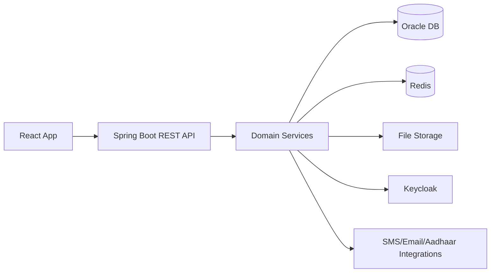

## 10.2 Backend Package Design

- `com.opsnabh.config`
- `com.opsnabh.security`
- `com.opsnabh.auth`
- `com.opsnabh.patient`
- `com.opsnabh.cardsearch`
- `com.opsnabh.caseflow`
- `com.opsnabh.preauth`
- `com.opsnabh.claims`
- `com.opsnabh.followup`
- `com.opsnabh.attachments`
- `com.opsnabh.masterdata`
- `com.opsnabh.workflow`
- `com.opsnabh.audit`
- `com.opsnabh.paneldoctor`
- `com.opsnabh.chronicop`
- `com.opsnabh.medicalaudit`
- `com.opsnabh.annualcheckup`
- `com.opsnabh.scheduler`
- `com.opsnabh.integration`
- `com.opsnabh.common`

## 10.3 Transaction Boundaries

- Patient registration: patient + case + audit (single transaction)
- Preauth clinical note save: notes + phase + audit
- Claim save/transition: claim + case status + workflow action + audit
- Follow-up save/submit: follow-up row + status action + audit
- Attachment upload: metadata DB + file write + audit (compensating strategy on file errors)

## 10.4 Concurrency Model

- optimistic locking (`@Version`) for mutable aggregates (case/claim/followup)
- transition checks enforce state preconditions in same transaction
- duplicate submit protection via idempotency keys for sensitive post actions

## 10.5 React LLD

- Domain-based feature folders: `auth`, `patient`, `caseflow`, `preauth`, `claims`, `followup`, `attachments`, `masters`
- Shared infrastructure: API client, auth context, route guards, audit-aware error handling
- Form validation mirrors backend rules (client-side pre-check + server-side source-of-truth)
- Worklist/table components support role filters and pagination

## 11. Class Diagrams (Module-Wise)

## 11.1 Authentication Module

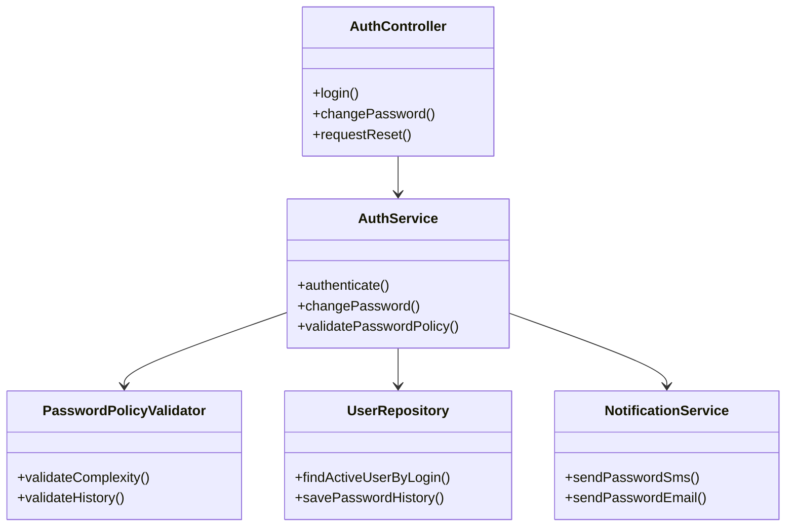

## 11.2 Patient Registration Module

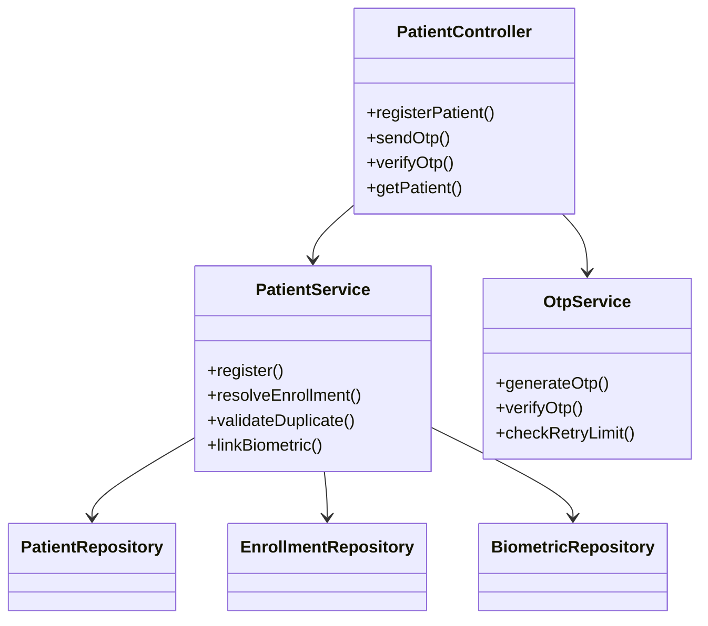

## 11.3 Case Search + Workflow Module

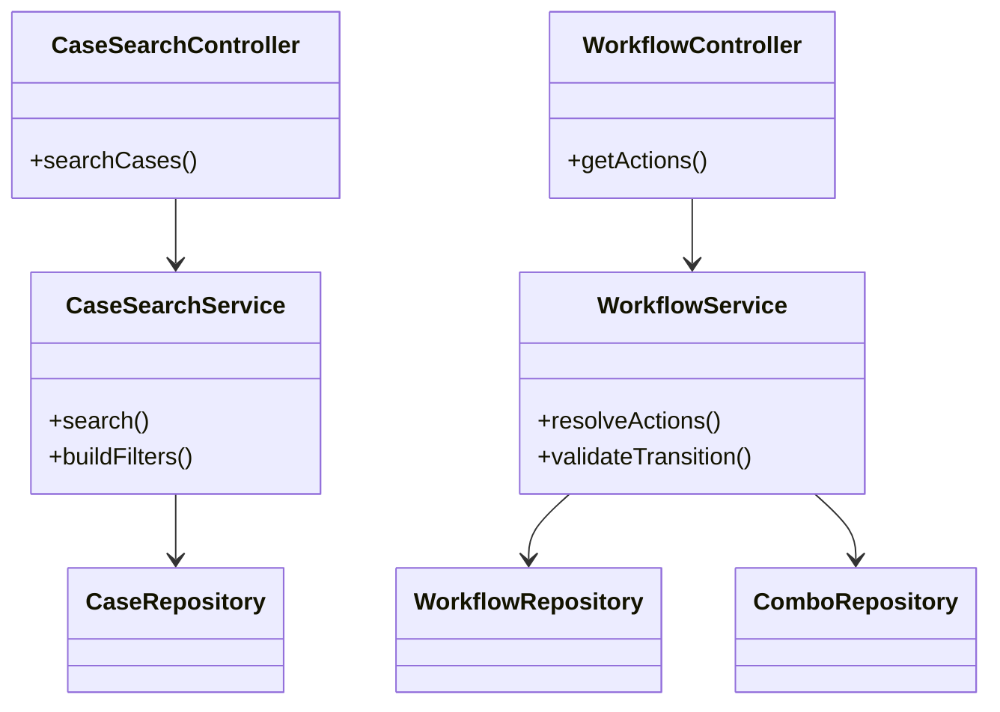

## 11.4 Preauth Module

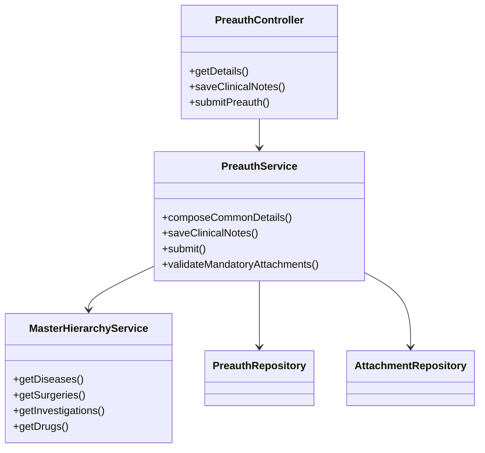

## 11.5 Claims Module

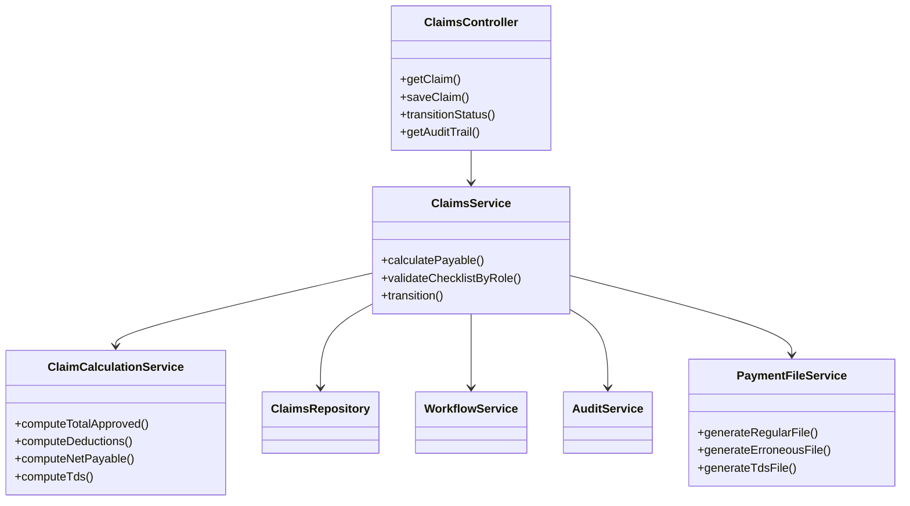

## 11.6 Follow-up Module

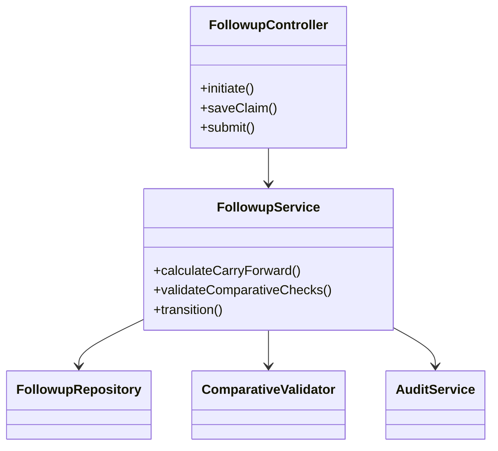

## 11.7 Attachment Module

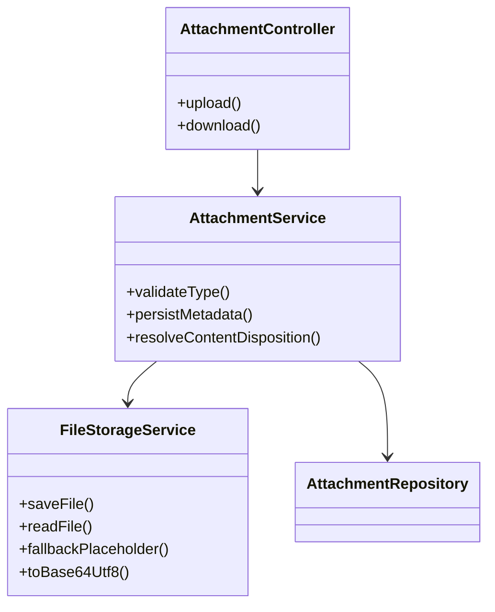

## 11.8 Master/Workflow/Audit Core Module

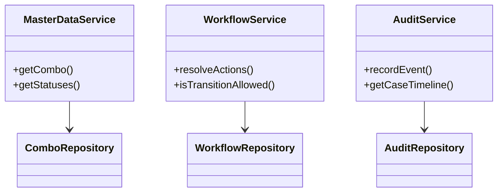

## 11.9 Panel Doctor + Payments Module

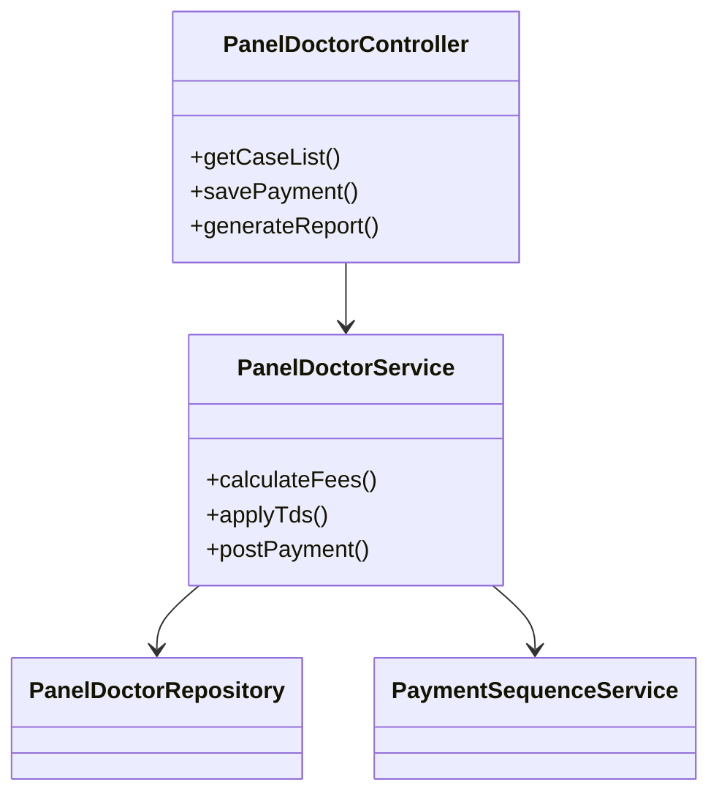

## 11.10 Medical Audit + Flagging Module

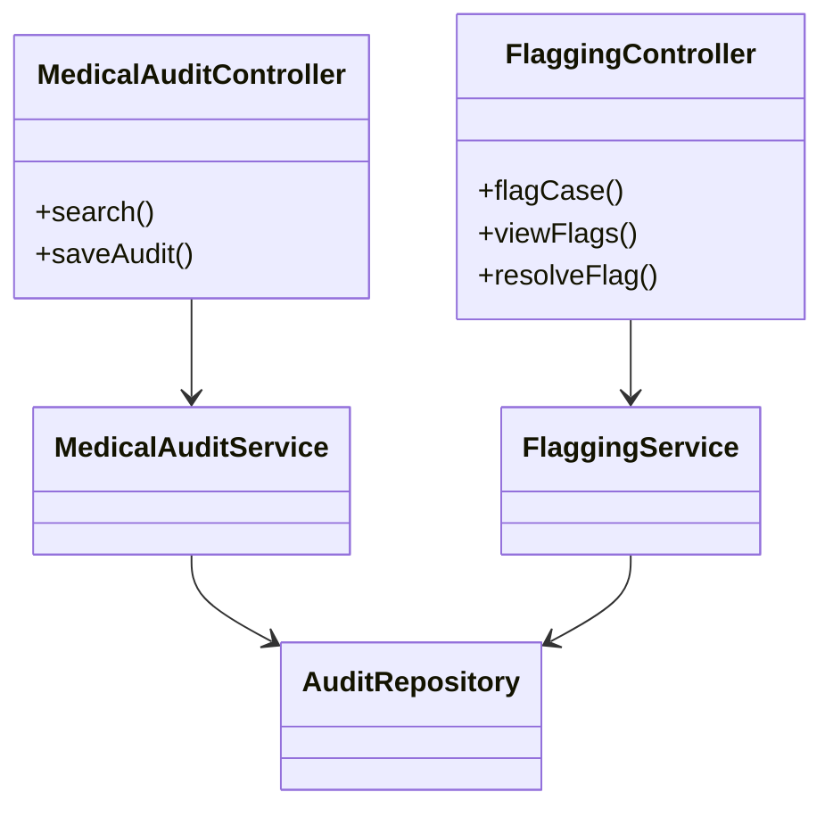

## 11.11 Chronic OP and AHC Module

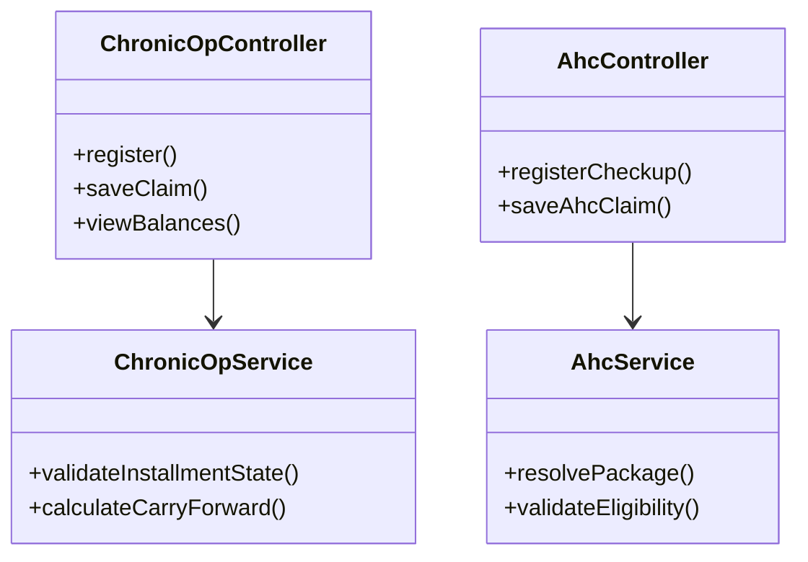

## 11.12 Scheduler Module

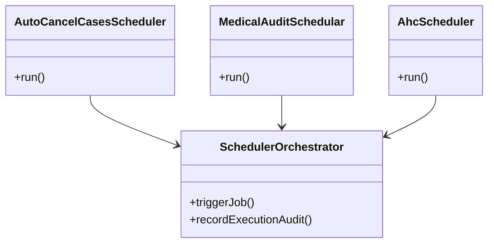

## 12. Redis Caching Design

- master lookup cache: `master:{domain}:{id}`
- workflow action cache: `master:workflow:{status}:{role}:{module}:{sub}`
- case summary cache: `ref:case:summary:{caseId}`
- patient summary cache: `ref:patient:summary:{patientId}`
- card photo base64 cache: `ref:card:photo:{cardNo}:v{n}`
- OTP cache: `temp:otp:{subject}` and `temp:otp:attempts:{subject}`

Policy:
- read-through for master/reference
- explicit evict on writes affecting case/patient/workflow/master
- no transactional decision from cache-only state

## 13. Security Design (Spring Security + Keycloak)

- JWT signature/issuer/audience/expiry validation
- realm/client role to authority mapping for MEDCO/Trust/Technical/ClaimHead/Accounts/CEO/etc.
- endpoint and method-level authorization
- security audit events for login, password change, transitions, payment readiness, attachment access
- TLS required end-to-end

## 14. UI -> API -> Service -> DB Traceability Matrix

| UI Flow | API | Service | Primary DB Objects |
|---|---|---|---|
| Login | `/api/auth/login` | `AuthService.authenticate` | `ehfm_users`, role mappings, audit |
| Password change | `/api/auth/password/change` | `AuthService.changePassword` | credentials/history/audit |
| Patient registration | `/api/patients/register` | `PatientService.register` | patient/case/enrollment/biometric/audit |
| OTP verify | `/api/patients/{id}/otp/verify` | `OtpService.verifyOtp` | patient_security/otp/audit |
| Card search | `/api/cards/search` | `CardSearchService.search` | enrollment/family/relation/attachment |
| Preauth submit | `/api/preauth/{caseId}/submit` | `PreauthService.submit` | case/workflow/audit/attachment |
| Claim transition | `/api/claims/{caseId}/status-transition` | `ClaimsService.transition` | claim/case/workflow_action/audit |
| Follow-up submit | `/api/followup/{caseId}/submit` | `FollowupService.submit` | followup/workflow_action/audit |
| Attachment read | `/api/attachments/{attachmentId}` | `AttachmentService.download` | attachment table + filesystem |

## 15. Implementation Checklist (Developer-Ready)

- [ ] create Spring Boot skeleton with domain packages from section 10.2
- [ ] implement Keycloak security and role mapper
- [ ] implement master/workflow repositories and cache layer
- [ ] implement auth + patient + OTP + card search flows
- [ ] implement preauth (hierarchy + attachments + transitions)
- [ ] implement claims (checklists + calculations + transitions + files)
- [ ] implement follow-up carry-forward + comparative checks
- [ ] implement attachment file service with legacy parity behavior
- [ ] implement chronic/panel/audit/AHC/CEO module services
- [ ] implement scheduler jobs with execution audit
- [ ] add contract tests for rule IDs BR-* and SQL parity snapshots

## 16. Acceptance Criteria

1. Same input produces same output/status/amount as legacy behavior.
2. Role-based transitions remain unchanged.
3. DB-driven actions/statuses remain dynamic.
4. File I/O and Base64 behavior match legacy.
5. Audit timeline completeness is preserved.
6. Cache changes latency only, not business decisions.

## 17. Final Notes

This document is intentionally implementation-heavy so a Spring Boot + React team can directly code from it while preserving all legacy business rules.

For any ambiguity in rule interpretation, resolve in this order:
1. DAO/service behavior in `src/com/ahct/**`
2. DB status/workflow dictionaries
3. properties-driven semantics
4. this document

## 18. Module-Wise Full API, UI, DB, Query, Request/Response Specification

This section closes the remaining documentation gaps by providing module-level details for:
- business logic (including constants/properties)
- UI pages and fields
- API contract (request/response)
- DB objects and key query patterns
- UI -> API -> DB field mapping

### 18.1 Common Conventions

- `traceId` is returned in all responses and errors.
- Time format is ISO-8601 UTC unless explicitly business-date only.
- Amounts are decimal(18,2) in API contracts.
- Workflow transitions must call workflow validation before update.

### 18.2 Module: Authentication and Profile

#### A) Business Logic (Constants-Driven)

- `MAX_INACTIVE_INTERVAL=1800` controls session inactivity behavior.
- Password policy messages sourced from:
  - `label.PWD.kmsMsgNewPwdNumeric`
  - `label.PWD.kmsMsgNewPwdSplChrs`
  - `label.PWD.kmsMsgNewPwdChrs`
  - `label.PWD.PwdHistory`
- Password change enforces old-password check, complexity check, history check.

#### B) UI Pages

`login/login.jsp`, `login/ChangePassword.jsp`, `login/updateProfile.jsp`, `login/sessionInvalid.jsp`

#### C) API Catalog

| API | Purpose | Request Model | Response Model | DB Tables | Query Ref |
|---|---|---|---|---|---|
| `POST /api/auth/login` | user login and role context | `AuthLoginRequest` | `AuthLoginResponse` | `ehfm_users`, role mapping, audit tables | Q-AUTH-01 |
| `POST /api/auth/password/change` | change password | `ChangePasswordRequest` | `OperationResponse` | credential + history + audit | Q-AUTH-02 |
| `GET /api/auth/profile` | load user profile/menus | `ProfileQuery` | `UserProfileResponse` | user/menu/role tables | Q-AUTH-03 |
| `PUT /api/auth/profile` | update profile | `UpdateProfileRequest` | `OperationResponse` | user profile tables | Q-AUTH-04 |
| `POST /api/auth/logout` | invalidate session/token | `LogoutRequest` | `OperationResponse` | audit/session metadata | Q-AUTH-05 |

#### D) Request/Response Models

```json
{
  "AuthLoginRequest": {
    "loginName": "string",
    "password": "string",
    "userType": "string"
  },
  "AuthLoginResponse": {
    "accessToken": "string",
    "refreshToken": "string",
    "userId": "string",
    "loginName": "string",
    "roles": ["string"],
    "menus": [{"menuCode": "string", "label": "string", "path": "string"}],
    "sessionTimeoutSeconds": 1800,
    "traceId": "string"
  }
}
```

#### E) UI -> API -> DB Field Mapping

| UI Label/Field | API Field | DB Column |
|---|---|---|
| Login Name | `loginName` | `ehfm_users.login_name` |
| Password | `password` | `ehfm_users.passwd` |
| User Type | `userType` | `ehfm_users.user_type` |
| Confirm New Password | `confirmPassword` | password history validation tables |

#### F) Key Query

```sql
-- Q-AUTH-01
SELECT login_name AS id
FROM ehfm_users
WHERE UPPER(login_name) = :loginName
  AND DECRYPT_USER_PSWD(passwd) = :password
  AND service_flag = 'Y'
  AND user_type = :userType
  AND service_expiry_dt IS NULL;
```

### 18.3 Module: Patient Registration, OTP, Telephonic, Biometrics

#### A) Business Logic (Constants-Driven)

- Card-type labels from `Registration.properties`:
  - `EHF.EmployeeCardNo`, `EHF.PensionerCardNo`, `EHF.JournalistCardNo`, `EHF.AisCardNo`.
- Registration field labels and mandatory guidance:
  - `EHF.MandatoryFields`, `EHF.DateOfBirth`, `EHF.ContactNo`, `EHF.Gender`, `EHF.Address`.
- OTP flow rules:
  - generation + expiry + retry; exemption flow via OTP exemption records.
- Telephonic rules use `EHF.CallerName`, `EHF.CallerNo`, `EHF.DateOfInt`, `EHF.PatientComplaint`.

#### B) UI Pages

`patient/patient.jsp`, `patient/PatientDetailsNew.jsp`, `patient/TelephonicPatientEntry.jsp`, `patient/ExemptOtp.jsp`, `createEmployee/BioMetricRegistration.jsp`

#### C) API Catalog

| API | Purpose | Request Model | Response Model | DB Tables | Query Ref |
|---|---|---|---|---|---|
| `POST /api/patients/register` | register patient + case | `PatientRegisterRequest` | `PatientRegisterResponse` | patient/case/enrollment/audit | Q-PAT-01 |
| `GET /api/patients/card-details` | resolve card details | `CardDetailsQuery` | `CardDetailsResponse` | enrollment/family tables | Q-PAT-02 |
| `POST /api/patients/{patientId}/otp/send` | send OTP | `SendOtpRequest` | `OtpSendResponse` | otp fields / security table | Q-PAT-03 |
| `POST /api/patients/{patientId}/otp/verify` | verify OTP | `VerifyOtpRequest` | `OtpVerifyResponse` | otp fields / security table | Q-PAT-04 |
| `POST /api/patients/{patientId}/otp-exemption/request` | request exemption | `OtpExemptionRequest` | `OperationResponse` | `ehf_otp_exemption` | Q-PAT-05 |
| `POST /api/telephonic/registrations` | telephonic registration | `TelephonicRegistrationRequest` | `TelephonicRegistrationResponse` | telephonic tables | Q-PAT-06 |
| `POST /api/biometric/enroll` | save biometric template | `BiometricEnrollRequest` | `OperationResponse` | biometric tables | Q-PAT-07 |

#### D) Request/Response Models

```json
{
  "PatientRegisterRequest": {
    "cardType": "EMPLOYEE|PENSIONER|JOURNALIST|AIS|NEW_BORN",
    "cardNo": "string",
    "name": "string",
    "dateOfBirth": "yyyy-MM-dd",
    "gender": "M|F",
    "contactNo": "string",
    "address": "string",
    "hospitalCode": "string",
    "patientType": "IP|OP|CHRONIC_OP",
    "photoBase64": "string"
  },
  "PatientRegisterResponse": {
    "patientId": "string",
    "caseId": "string",
    "registrationStatus": "REGISTERED|PENDING_OTP|FAILED",
    "nextAction": "string",
    "traceId": "string"
  }
}
```

#### E) UI -> API -> DB Field Mapping

| UI Label/Field | API Field | DB Column |
|---|---|---|
| `EHF.Cardtype` | `cardType` | enrollment type code columns |
| `EHF.EmployeeCardNo` / related | `cardNo` | `ehf_enrollment_family.ehf_card_no` / journalist card columns |
| `EHF.Name` | `name` | patient/enrollment name columns |
| `EHF.DateOfBirth` | `dateOfBirth` | DOB columns |
| `EHF.ContactNo` | `contactNo` | patient contact/mobile columns |
| `EHF.Gender` | `gender` | gender columns |
| `EHF.PatientComplaint` | `complaint` | telephonic complaint columns |

#### F) Key Queries

```sql
-- Q-PAT-01
SELECT case_id AS caseId
FROM ehf_case
WHERE case_patient_no = :patientId;

-- Q-PAT-02
SELECT DISTINCT f.enroll_name AS name,
       TO_CHAR(f.enroll_dob) AS dateOfBirth,
       f.enroll_gender AS gender,
       f.ehf_card_no AS cardNumber
FROM ehf_enrollment_family f,
     ehf_enrollment e
WHERE e.enroll_prnt_id = f.enroll_prnt_id
  AND f.ehf_card_no LIKE ('%' || UPPER(:cardNo) || '%');
```

### 18.4 Module: Card Search and Photo

#### A) Business Logic (Constants-Driven)

- UI labels from Registration and card modules (`EHF.Cardtype`, card-no keys).
- File fallback behavior for missing photo is mandatory.
- Base64 encoding and UTF-8 conversion parity is mandatory.

#### B) UI Pages

`cardSearch/cardSearchPage.jsp`, `cardSearch/cardViewPage.jsp`, `cardSearch/empCardViewPage.jsp`

#### C) API Catalog

| API | Purpose | Request Model | Response Model | DB Tables | Query Ref |
|---|---|---|---|---|---|
| `GET /api/cards/search` | card search by mode | `CardSearchQuery` | `CardSearchResponse` | enrollment/journalist/relation tables | Q-CARD-01 |
| `GET /api/cards/{cardNo}/photo` | photo retrieval | `CardPhotoQuery` | `CardPhotoResponse` | attachment/photo columns + filesystem | Q-CARD-02 |
| `GET /api/cards/{cardNo}/user` | resolve internal user | `CardUserQuery` | `CardUserResponse` | user + enrollment linkage | Q-CARD-03 |

#### D) Request/Response Models

```json
{
  "CardSearchResponse": {
    "results": [
      {
        "cardNo": "string",
        "name": "string",
        "gender": "string",
        "relation": "string",
        "district": "string",
        "status": "string",
        "aadharId": "string"
      }
    ],
    "total": 0,
    "traceId": "string"
  },
  "CardPhotoResponse": {
    "cardNo": "string",
    "photoBase64": "string",
    "contentType": "image/jpeg",
    "placeholderUsed": false,
    "traceId": "string"
  }
}
```

#### E) UI -> API -> DB Field Mapping

| UI Field | API Field | DB Column |
|---|---|---|
| Card Number | `cardNo` | card columns in enrollment/journalist tables |
| Relation | `relation` | `ehfm_relation_mst.relation_name` |
| Photo | `photoBase64` | photo path or photo blob columns |

#### F) Key Query

```sql
-- Q-CARD-01
SELECT ef.name AS name,
       TO_CHAR(ef.dob) AS dateOfBirth,
       ef.gender AS gender,
       rm.relation_name AS relation,
       ef.journal_card_no AS cardNumber
FROM ehf_jrnlst_enrollment ee,
     ehf_jrnlst_family ef,
     ehfm_relation_mst rm,
     ehfm_jrnlst j
WHERE ef.journal_card_no LIKE ('%' || UPPER(:cardNo) || '%')
  AND j.login_name = ee.journal_code
  AND ee.journal_enroll_prnt_id = ef.journal_enroll_prnt_id
  AND ef.relation = rm.relation_id;
```

### 18.5 Module: Case Search, Workflow, Master Data

#### A) Business Logic (Constants-Driven)

- `case.RowsPerPage=10`, `case.StartIndex*`, `case.next` drive pagination defaults.
- `CASE.CaseRegistered=CD73`, `CASE.OnBed=CD483` are state anchors.
- `Role.Aarogyamithra=CD10`, `Role.Ramco=CD9` influence visibility scopes.
- Workflow buttons and transitions are DB-driven (`ehfm_workflow` + `ehfm_cmb_dtls`).

#### B) UI Pages

`caseSearch/CasesViewSearchBootstrap.jsp`, `caseSearch/csvDownloads.jsp`, `CEO/operationsWorkflow.jsp`

#### C) API Catalog

| API | Purpose | Request Model | Response Model | DB Tables | Query Ref |
|---|---|---|---|---|---|
| `GET /api/cases/search` | paged search | `CaseSearchQuery` | `CaseSearchResponse` | case/claim/patient/workflow | Q-CASE-01 |
| `GET /api/workflow/actions` | resolve buttons/actions | `WorkflowActionQuery` | `WorkflowActionResponse` | `ehfm_workflow`, `ehfm_cmb_dtls` | Q-CASE-02 |
| `GET /api/master/combo/{cmbHdrId}` | combo values | `ComboQuery` | `ComboResponse` | combo/location tables | Q-CASE-03 |
| `GET /api/master/statuses` | context statuses | `StatusQuery` | `StatusResponse` | combo/workflow status tables | Q-CASE-04 |

#### D) Request/Response Models

```json
{
  "CaseSearchQuery": {
    "caseNo": "string",
    "claimNo": "string",
    "patientName": "string",
    "status": "string",
    "fromDate": "yyyy-MM-dd",
    "toDate": "yyyy-MM-dd",
    "page": 1,
    "size": 10
  },
  "CaseSearchResponse": {
    "content": [{"caseId": "string", "caseNo": "string", "status": "string", "patientName": "string"}],
    "page": 1,
    "size": 10,
    "totalElements": 0,
    "traceId": "string"
  }
}
```

#### E) UI -> API -> DB Field Mapping

| UI Label/Field | API Field | DB Column |
|---|---|---|
| `EHF.title.caseNo` | `caseNo` | `ehf_case.case_id/case_no` |
| `EHF.title.patientName` | `patientName` | patient name columns |
| `EHF.title.fromDte` / `toDate` | `fromDate` / `toDate` | case/claim date columns |
| Worklist button code | action `code` | `ehfm_workflow.button_name` |

#### F) Key Query

```sql
-- Q-CASE-02
SELECT ew.button_name AS id,
       ac.cmb_dtl_name AS value
FROM ehfm_workflow ew
JOIN ehfm_cmb_dtls ac ON ew.button_name = ac.cmb_dtl_id
WHERE ew.curr_status = :currentStatus
  AND ew.curr_role = :currentRole
  AND ew.main_module = :mainModule
  AND ew.sub_module = :subModule
  AND ew.active_yn = 'Y'
ORDER BY ac.cmb_dtl_name;
```

### 18.6 Module: Preauthorization

#### A) Business Logic (Constants-Driven)

- Preauth labels and checklists are driven by `Preauth.*` keys.
- Hierarchical medical master filtering must preserve disease -> surgery -> investigation -> drug flow.
- Mandatory attachments before submit.
- Phase transition and audit insertion are mandatory.

#### B) UI Pages

`Preauth/PreauthDetails.jsp`, `Preauth/preauthClinicalNotes.jsp`, `Preauth/OnlineCaseSheet.jsp`

#### C) API Catalog

| API | Purpose | Request Model | Response Model | DB Tables | Query Ref |
|---|---|---|---|---|---|
| `GET /api/preauth/{caseId}/details` | patient/case + medical masters | `PreauthDetailsQuery` | `PreauthDetailsResponse` | case/patient/master tables | Q-PRE-01 |
| `POST /api/preauth/{caseId}/clinical-notes` | save notes + attachments link | `PreauthClinicalNotesRequest` | `OperationResponse` | clinical notes/case/audit | Q-PRE-02 |
| `POST /api/preauth/{caseId}/submit` | submit preauth | `PreauthSubmitRequest` | `OperationResponse` | case/workflow/audit | Q-PRE-03 |
| `GET /api/preauth/{caseId}/masters` | hierarchy lookup | `PreauthMasterQuery` | `PreauthMasterResponse` | speciality/surgery/investigation/drugs | Q-PRE-04 |

#### D) Request/Response Models

```json
{
  "PreauthClinicalNotesRequest": {
    "caseId": "string",
    "clinicalSummary": "string",
    "diagnosisCodes": ["string"],
    "surgeryCodes": ["string"],
    "investigationCodes": ["string"],
    "drugItems": [{"drugCode": "string", "dosage": "string", "medicationPeriodDays": 0}],
    "attachmentIds": ["string"],
    "remarks": "string"
  },
  "OperationResponse": {
    "status": "SUCCESS|FAILED",
    "message": "string",
    "traceId": "string"
  }
}
```

#### E) UI -> API -> DB Field Mapping

| UI Label/Field | API Field | DB Column |
|---|---|---|
| `EHF.Diagnosis` | `diagnosisCodes` | diagnosis tables/code columns |
| `EHF.Therapy` | `surgeryCodes` / therapy fields | therapy tables |
| `EHF.Investigations` | `investigationCodes` | investigation tables |
| `EHF.Attachment` | `attachmentIds` | case attachment link tables |

#### F) Key Query

```sql
-- Q-PRE-01
SELECT DISTINCT adm.dis_main_id AS id,
       adm.dis_main_name AS value
FROM ehfm_specialities adm,
     asrim_hosp_speciality ahs
WHERE adm.dis_main_id = ahs.speciality_id
  AND ahs.hosp_id = :hospitalCode
  AND ahs.active_yn = 'Y'
  AND (:renewal IS NULL OR ahs.renewal = :renewal)
  AND (:phase IS NULL OR ahs.phase_id = :phase)
ORDER BY adm.dis_main_name;
```

### 18.7 Module: Claims Processing

#### A) Business Logic (Constants-Driven)

- Role constants: `EHF.Claims.Role.MEDCO=GP2`, `Mithra=GP1`, `CEX=GP6`, `COCCEX=GP72`, `CTD=GP8`, `CH=GP9`.
- Button constants: `EHF.Button.*` (initiate/forward/approve/reject/save/submit/verify/paynow/etc.).
- Claim labels/checklists from `EHF.Claim.*` and `EHF.Title.*` keys.
- Status constants: `EHF.claim.Status.AccVefied=CD93`, `CHVefied=CD96`, discussion/clear codes.

#### B) UI Pages

`claimsFlow/viewClaimPage.jsp`, `claimsFlow/claimsPayment.jsp`, `claimsFlow/errClaimsPayment.jsp`, `claimsFlow/tdsClaimsPayment.jsp`

#### C) API Catalog

| API | Purpose | Request Model | Response Model | DB Tables | Query Ref |
|---|---|---|---|---|---|
| `GET /api/claims/{caseId}` | claim summary + checklist | `ClaimSummaryQuery` | `ClaimSummaryResponse` | case/claim/checklist/combo/audit | Q-CLM-01 |
| `POST /api/claims/{caseId}/save` | save claim draft | `ClaimSaveRequest` | `ClaimSaveResponse` | claim/case/audit | Q-CLM-02 |
| `POST /api/claims/{caseId}/status-transition` | workflow move by role | `ClaimTransitionRequest` | `ClaimTransitionResponse` | workflow_action/case/claim/audit | Q-CLM-03 |
| `GET /api/claims/{caseId}/audit-trail` | timeline | `ClaimAuditQuery` | `ClaimAuditResponse` | audit/workflow_action | Q-CLM-04 |
| `POST /api/claims/payment-files/generate` | generate payment files | `PaymentFileGenerateRequest` | `PaymentFileGenerateResponse` | upload/payment sequence/audit | Q-CLM-05 |

#### D) Request/Response Models

```json
{
  "ClaimSaveRequest": {
    "caseId": "string",
    "claimAmount": 0.0,
    "deductionAmount": 0.0,
    "approvedAmount": 0.0,
    "checklist": {
      "nonTech": [{"code": "string", "value": "Y|N", "remarks": "string"}],
      "trustDoctor": [{"code": "string", "value": "Y|N", "remarks": "string"}],
      "technical": [{"code": "string", "value": "Y|N", "remarks": "string"}]
    },
    "remarks": "string"
  },
  "ClaimTransitionRequest": {
    "actionCode": "CD23",
    "currentStatus": "string",
    "roleCode": "GP2",
    "remarks": "string"
  },
  "ClaimTransitionResponse": {
    "caseId": "string",
    "oldStatus": "string",
    "newStatus": "string",
    "allowedNextActions": [{"code": "string", "label": "string"}],
    "traceId": "string"
  }
}
```

#### E) UI -> API -> DB Field Mapping

| UI Label/Field | API Field | DB Column |
|---|---|---|
| `EHF.Claim.PackAmt` | `preauthApprovedAmount` | claim/preauth amount columns |
| `EHF.Claim.TotalClaimable` | `totalClaimableAmount` | computed from claim amount fields |
| `EHF.Claim.techCheck2` | `deductionAmount` | claim deduction columns |
| `EHF.Button.*` code | `actionCode` | workflow button/action columns |
| `EHF.workFlow.reamark` | `remarks` | audit remarks columns |

#### F) Key Queries

```sql
-- Q-CLM-01
SELECT SUM(NVL(ex.total_amount, 0)) AS totalAmount
FROM ehf_case_consumables ex
WHERE ex.case_id = :caseId;

-- Q-CLM-04
SELECT MAX(au.id.actOrder) AS count
FROM ehf_audit au
WHERE au.id.caseId = :caseId;
```

### 18.8 Module: Follow-Up Claims

#### A) Business Logic (Constants-Driven)

- Role constants: `EHF.Claims.Role.NAM=GP1`, `FCX=GP10`, `FTD=GP11`, `CH=GP9`, `ACO=GP17`.
- Follow-up labels: `EHF.FollowUpId`, `EHF.CarryFwd`, `EHF.BalanceAvailb`, `EHF.MaxAmtCanBeRaised`.
- Checklist labels: `EHF.NonTechChkListPhoto*`, `EHF.NonTechChkListDoc*`, `EHF.TrustDoctChkList*`.
- Follow-up payment statuses: `EHF.FP.Status.AccVefied=CD104`, `CHVefied=CD107`.

#### B) UI Pages

`FollowUp/followUpInit.jsp`, `FollowUp/followUpClaimForm.jsp`, `FollowUp/fpclaimsPayment.jsp`, `FollowUp/viewClinicalData.jsp`

#### C) API Catalog

| API | Purpose | Request Model | Response Model | DB Tables | Query Ref |
|---|---|---|---|---|---|
| `POST /api/followup/{caseId}/initiate` | initiate follow-up case | `FollowupInitiateRequest` | `FollowupInitiateResponse` | followup/case/audit | Q-FUP-01 |
| `GET /api/followup/{caseId}/eligibility` | check window + balance | `FollowupEligibilityQuery` | `FollowupEligibilityResponse` | followup/case/claim tables | Q-FUP-02 |
| `POST /api/followup/{caseId}/claim` | save follow-up claim | `FollowupClaimRequest` | `FollowupClaimResponse` | followup/attachment/audit | Q-FUP-03 |
| `POST /api/followup/{caseId}/submit` | submit for workflow | `FollowupSubmitRequest` | `OperationResponse` | workflow_action/workflow_status/audit | Q-FUP-04 |

#### D) Request/Response Models

```json
{
  "FollowupClaimRequest": {
    "caseId": "string",
    "followupId": "string",
    "followupDate": "yyyy-MM-dd",
    "carryForwardAmount": 0.0,
    "claimAmount": 0.0,
    "deductionAmount": 0.0,
    "comparativeChecklist": [{"code": "string", "value": "Y|N", "remarks": "string"}],
    "attachmentIds": ["string"],
    "remarks": "string"
  },
  "FollowupClaimResponse": {
    "followupId": "string",
    "availableBalance": 0.0,
    "approvedPayable": 0.0,
    "status": "string",
    "traceId": "string"
  }
}
```

#### E) UI -> API -> DB Field Mapping

| UI Label/Field | API Field | DB Column |
|---|---|---|
| `EHF.FollowUpId` | `followupId` | `ehf_case_followup_claim.case_followup_id` |
| `EHF.CarryFwd` | `carryForwardAmount` | follow-up carry-forward columns |
| `EHF.BalanceAvailb` | `availableBalance` | computed from claim/follow-up columns |
| `EHF.NonTechChkListDoc2` | checklist item code/value | follow-up checklist columns |

#### F) Key Query

```sql
-- Q-FUP-01
SELECT a.cochlear_yn AS cochlearYn
FROM ehf_case_followup_claim a
WHERE a.case_followup_id = :followUpId;
```

### 18.9 Module: Attachments and File Handling

#### A) Business Logic (Constants-Driven)

- Attachment categories use constants and combo/detail IDs (for on-bed photo, signed docs, comparative docs).
- Allowed file types vary by category.
- Serve mode (`inline` vs `attachment`) based on content type.
- Missing file must route to placeholder behavior.

#### B) UI Pages

`attachments/Attachment.jsp`, `attachments/casesAttachment.jsp`, `attachments/claimPayAttachment.jsp`, `attachments/uploadAttachmentBootstrap.jsp`

#### C) API Catalog

| API | Purpose | Request Model | Response Model | DB Tables | Query Ref |
|---|---|---|---|---|---|
| `POST /api/attachments` | upload and link file | `AttachmentUploadRequest` | `AttachmentUploadResponse` | attachment/case/audit | Q-ATT-01 |
| `GET /api/attachments/{attachmentId}` | stream file | `AttachmentDownloadQuery` | file stream metadata | attachment table + filesystem | Q-ATT-02 |
| `GET /api/attachments/case/{caseId}` | list case files | `CaseAttachmentQuery` | `CaseAttachmentListResponse` | attachment/case status | Q-ATT-03 |

#### D) Request/Response Models

```json
{
  "AttachmentUploadRequest": {
    "caseId": "string",
    "attachmentTypeCode": "string",
    "fileName": "string",
    "contentType": "string",
    "remarks": "string"
  },
  "AttachmentUploadResponse": {
    "attachmentId": "string",
    "storedPath": "string",
    "status": "UPLOADED",
    "traceId": "string"
  }
}
```

#### E) UI -> API -> DB Field Mapping

| UI Label/Field | API Field | DB Column |
|---|---|---|
| Attachment Type | `attachmentTypeCode` | attachment type columns |
| File Name | `fileName` | file name/saved name columns |
| Remarks | `remarks` | attachment remarks columns |
| Case No | `caseId` | case link columns |

#### F) Key Query

```sql
-- Q-ATT-02
SELECT a.file_name AS fileName,
       a.file_path AS filePath,
       a.crt_date AS crtDt
FROM ehf_claim_upload_file a;
```

### 18.10 Module: Panel Doctor Payment

#### A) Business Logic

- Fee aggregation by doctor/case/specialty.
- Payment sequence generation with account sequences.
- TDS and payable output preserved for reporting and payment files.

#### B) UI Pages

`panelDoctor/panelDoctorPay.jsp`, `panelDoctor/panelDoctorCaseList.jsp`, `panelDoctor/panelDocTDSPmnt.jsp`, `panelDoctor/panelDocRept.jsp`

#### C) API Catalog

| API | Purpose | Request Model | Response Model | DB Tables | Query Ref |
|---|---|---|---|---|---|
| `GET /api/panel-doctor/cases` | cases for payment | `PanelCaseQuery` | `PanelCaseResponse` | panel doctor + claim tables | Q-PNL-01 |
| `POST /api/panel-doctor/payments` | approve/post payment | `PanelPaymentRequest` | `PanelPaymentResponse` | payment tables + sequences | Q-PNL-02 |
| `GET /api/panel-doctor/reports` | payment reports | `PanelReportQuery` | `PanelReportResponse` | payment/audit tables | Q-PNL-03 |

### 18.11 Module: Medical Audit and Flagging

#### A) Business Logic

- suspicious case flag creation and resolution path
- audit commentary and status update are mandatory
- flagged case can re-enter workflow with controlled transitions

#### B) UI Pages

`medicalAudit/medicalAuditSearch.jsp`, `medicalAudit/medicalAuditWorklist.jsp`, `Flagging/Flagging.jsp`, `Flagging/viewFlaggedCases.jsp`

#### C) API Catalog

| API | Purpose | Request Model | Response Model | DB Tables |
|---|---|---|---|---|
| `GET /api/medical-audit/cases` | search audit cases | `MedicalAuditSearchQuery` | `MedicalAuditSearchResponse` | audit/case tables |
| `POST /api/medical-audit/cases/{caseId}/remarks` | save audit findings | `MedicalAuditRemarkRequest` | `OperationResponse` | audit remarks tables |
| `POST /api/flagging/cases/{caseId}` | flag case | `FlagCaseRequest` | `OperationResponse` | flag tables + audit |
| `POST /api/flagging/cases/{caseId}/resolve` | resolve flag | `ResolveFlagRequest` | `OperationResponse` | flag tables + workflow |

### 18.12 Module: Chronic OP

#### A) Business Logic (Constants-Driven)

- roles from FollowUp property file:
  - `EHF.ChronicOp.Role.NAM=GP1`
  - `EHF.ChronicOp.Role.Medco=GP2`
  - `EHF.ChronicOp.Role.COEX=GP221`
  - `EHF.ChronicOp.Role.COTD=GP5`
  - `EHF.ChronicOp.Role.COCH=GP9`
  - `EHF.ChronicOp.Role.COACO=GP17`
- installment state and carry-forward arithmetic must be preserved.

#### B) UI Pages

`ChronicOP/chronicPatientDetails.jsp`, `ChronicOP/chronicOpclaimForm.jsp`, `ChronicOP/chronicOPCasesView.jsp`

#### C) API Catalog

| API | Purpose | Request Model | Response Model | DB Tables |
|---|---|---|---|---|
| `POST /api/chronic-op/{caseId}/initiate` | initiate installment claim | `ChronicInitiateRequest` | `OperationResponse` | chronic case tables |
| `POST /api/chronic-op/{caseId}/claim` | save installment claim | `ChronicClaimRequest` | `ChronicClaimResponse` | chronic claim tables |
| `POST /api/chronic-op/{caseId}/submit` | submit for approval | `ChronicSubmitRequest` | `OperationResponse` | workflow + chronic audit |
| `GET /api/chronic-op/{caseId}/balances` | view balance state | `ChronicBalanceQuery` | `ChronicBalanceResponse` | chronic balance tables |

### 18.13 Module: Annual Health Checkup (AHC)

#### A) Business Logic

- package eligibility + investigation capture + AHC claim route.
- AHC claim/pay flow includes specific attachments and payment stage pages.

#### B) UI Pages

`AnnualCheckUp/AnnualCheckUp.jsp`, `AnnualCheckUp/AnnualPatient.jsp`, `AnnualCheckUp/AhcClaimsPage.jsp`, `AnnualCheckUp/EoPayment.jsp`

#### C) API Catalog

| API | Purpose | Request Model | Response Model | DB Tables |
|---|---|---|---|---|
| `POST /api/ahc/patients/register` | register AHC patient | `AhcRegisterRequest` | `AhcRegisterResponse` | AHC patient/case tables |
| `POST /api/ahc/claims` | create AHC claim | `AhcClaimRequest` | `AhcClaimResponse` | AHC claim tables |
| `GET /api/ahc/claims/{claimId}` | AHC claim detail | `AhcClaimQuery` | `AhcClaimDetailResponse` | AHC claim + attachment |
| `POST /api/ahc/claims/{claimId}/payment` | AHC payment flow | `AhcPaymentRequest` | `OperationResponse` | payment/audit tables |

### 18.14 Module: CEO/Admin Sanction and Worklist

#### A) Business Logic

- high-value/escalation approvals, sanctions, send-back and remarks tracking.
- CEO worklist visibility is role and status based.

#### B) UI Pages

`CEO/ceoWorkList.jsp`, `CEO/adminSanctionWF.jsp`, `CEO/sanctionWorkFlow.jsp`, `CEO/aprvlsPage.jsp`

#### C) API Catalog

| API | Purpose | Request Model | Response Model | DB Tables |
|---|---|---|---|---|
| `GET /api/ceo/worklist` | pending approvals | `CeoWorklistQuery` | `CeoWorklistResponse` | CEO worklist tables |
| `POST /api/ceo/approvals/{caseId}` | approve/reject/send-back | `CeoDecisionRequest` | `OperationResponse` | approval remarks/status tables |
| `POST /api/ceo/sanctions` | create sanction | `AdminSanctionRequest` | `AdminSanctionResponse` | sanction metadata/audit |
| `GET /api/ceo/sanctions/{sanctionId}` | sanction detail | `AdminSanctionQuery` | `AdminSanctionDetailResponse` | sanction tables |

### 18.15 Module: Scheduler APIs (Operational Control)

#### A) Business Logic

- jobs must preserve legacy timing and side effects:
  - Auto-cancel pending cases
  - Medical audit scheduler
  - AHC scheduler
- each run writes execution audit.

#### B) UI Pages

`Schedulers/schedulersLinks.jsp`

#### C) API Catalog

| API | Purpose | Request Model | Response Model |
|---|---|---|---|
| `POST /api/schedulers/auto-cancel/run` | trigger auto-cancel job | `SchedulerRunRequest` | `SchedulerRunResponse` |
| `POST /api/schedulers/medical-audit/run` | trigger medical audit job | `SchedulerRunRequest` | `SchedulerRunResponse` |
| `POST /api/schedulers/ahc/run` | trigger AHC job | `SchedulerRunRequest` | `SchedulerRunResponse` |
| `GET /api/schedulers/executions` | execution log | `SchedulerExecutionQuery` | `SchedulerExecutionResponse` |

### 18.16 Global Query Reference Index

| Query Ref | Module | Purpose |
|---|---|---|
| Q-AUTH-01..05 | Auth | login/password/profile |
| Q-PAT-01..07 | Patient | registration/card/otp/telephonic/biometric |
| Q-CARD-01..03 | Card Search | search/photo/user resolve |
| Q-CASE-01..04 | Case/Workflow | search/actions/combo/status |
| Q-PRE-01..04 | Preauth | details/masters/submit |
| Q-CLM-01..05 | Claims | amount/audit/transition/payment files |
| Q-FUP-01..04 | Follow-up | initiate/eligibility/claim/submit |
| Q-ATT-01..03 | Attachment | upload/list/download |
| Q-PNL-01..03 | Panel | list/post/report |

### 18.17 Module Implementation Notes (How to Use This Section)

1. Use each module API table as the source for controller endpoints.
2. Generate DTOs exactly from request/response blocks.
3. Use mapping tables while building React forms and table columns.
4. Use query refs to validate SQL parity tests during migration.
5. Tie every service method to one or more `BR-*` rule IDs and add audit logging.

### 18.18 Missing Query Definitions (Completed)

This subsection defines previously referenced query IDs that were missing.

#### Q-PRE-02 - Save Clinical Notes + Drug Rows

```sql
-- sequence generation
SELECT EHF_CASE_CLINICAL_NOTES_seq.NEXTVAL AS NEXTVAL FROM dual;

-- clinical notes insert (representative)
INSERT INTO ehf_case_clinical_notes (
  clinical_id, case_id, investigation_date, bp_systolic, pulse, temperature,
  heart_rate, ward_type, lungs_condition, respiratory, fluid_input, fluid_output,
  pre_post_operative, wound_status, wound_dtls, remarks, therapy_dtls,
  crt_dt, crt_usr, lst_upd_dt, lst_upd_usr
) VALUES (
  :clinicalId, :caseId, :investigationDate, :bp, :pulse, :temperature,
  :heartRate, :wardType, :lungs, :respiratory, :fluidInput, :fluidOutput,
  :prePostOperative, :woundStatus, :woundDetails, :remarks, :therapyFlag,
  SYSTIMESTAMP, :userId, SYSTIMESTAMP, :userId
);

-- ip drug insert (repeat per item)
INSERT INTO ehf_case_ip_drugs (
  drug_id, case_id, clinical_id, drug_type_code, drug_sub_type_code,
  phar_sub_grp_code, che_sub_grp_code, drug_code, route_type, route,
  strength_type, strength, dosage, medication_period, crt_dt, crt_usr
) VALUES (
  ip_drug_seq.NEXTVAL, :caseId, :clinicalId, :drugTypeCode, :drugSubTypeCode,
  :pharSubGrpCode, :cheSubGrpCode, :drugCode, :routeType, :route,
  :strengthType, :strength, :dosage, :medicationPeriod, SYSTIMESTAMP, :userId
);
```

#### Q-PRE-03 - Submit/Discharge Transition + Audit Write

```sql
-- current max act order
SELECT MAX(au.id.actOrder) AS count
FROM ehf_audit au
WHERE au.id.caseId = :caseId;

-- case status update for clinical/discharge step
UPDATE ehf_case
SET case_status = :nextStatus,
    cs_dis_dt = :dischargeDate,
    cs_dis_upd_by = :userId,
    cs_dis_upd_dt = SYSTIMESTAMP,
    lst_upd_usr = :userId,
    lst_upd_dt = SYSTIMESTAMP
WHERE case_id = :caseId;

-- audit insert
INSERT INTO ehf_audit (
  act_order, case_id, act_id, act_by, crt_usr, crt_dt, lang_id
) VALUES (
  :actOrder, :caseId, :actionId, :userId, :userId, SYSTIMESTAMP, 'en_US'
);
```

#### Q-PRE-04 - Preauth Masters and Common Details

```sql
-- common patient/case details
SELECT DISTINCT p.name AS patientName,
       ec.caseNo AS caseNo,
       ec.claimNo AS claimNo,
       ec.caseId AS caseId,
       p.patientId AS patientId,
       ec.caseStatus AS caseStatus,
       p.cardNo AS cardNo,
       p.patientIpop AS patientType
FROM ehf_patient p,
     ehf_case ec,
     ehfm_cmb_dtls a
WHERE p.patientId = ec.casePatientNo
  AND a.cmbDtlId = ec.caseStatus
  AND ec.caseId = :caseId;

-- surgery master by disease
SELECT asu.surgery_id || '~' || asu.surg_desc || '-' || asu.surg_disp_code AS id
FROM asrim_surgery asu
WHERE asu.dis_main_id = :disMainId
  AND asu.medmgmt_yn = :therapyType
  AND asu.active_yn = 'Y';

-- investigation by selected surgery list
SELECT DISTINCT eti.investigation_id || '~' || eti.invest_desc AS id
FROM ehfm_therapy_invest eti
WHERE eti.icd_proc_code IN (:surgeryIds);
```

### 18.19 Telephonic Module - Detailed Coverage

#### A) Legacy Action Flags and Functional Intent

- `telephonicIntimationSearch`: telephonic cases visible to mithra context with pagination.
- `telephonicIntimationRaised`: raised/intimated cases listing with filters.

#### B) Additional APIs (Detailed)

| API | Purpose | Key Filters | Response Notes |
|---|---|---|---|
| `GET /api/telephonic/intimations/search` | mithra-wise telephonic worklist | `telephonicId`, `fromDate`, `toDate`, paging | status computed by age of `crtDt` |
| `GET /api/telephonic/intimations/raised` | all raised telephonic records | `telephonicId`, `healthCardNo`, `schemeId`, date range | supports pagination and total count |
| `GET /api/telephonic/intimations/{telephonicId}` | full telephonic details for registration handoff | id path param | returns patient + therapy + diagnosis context |

#### C) Telephonic Query Patterns

```sql
-- Q-PAT-06A: telephonic search for mithra
SELECT DISTINCT
  CASE WHEN (SYSDATE - trr.crt_dt) <= 6 THEN 'Telephonic Intimation-Initiated'
       WHEN (SYSDATE - trr.crt_dt) > 6 THEN 'Telephonic Intimation Cancelled' END AS teleStatus,
  trr.telephonic_id,
  trr.card_no,
  trr.name,
  trr.crt_dt,
  trr.caller_name,
  trr.caller_mobile_no,
  el.loc_name,
  eh.hosp_name
FROM ehf_telephonic_regn trr,
     ehfm_hospitals eh,
     ehfm_locations el,
     ehfm_hosp_mithra_dtls emu
WHERE trr.hosp_id = eh.hosp_id
  AND el.loc_id = trr.district_code
  AND emu.hosp_id = trr.hosp_id
  AND emu.mithra_id = :userId
  AND trr.patient_id IS NULL
  AND emu.end_dt IS NULL;

-- Q-PAT-06B: telephonic details by id
SELECT trr.telephonic_id,
       trr.card_no,
       trr.card_type,
       trr.name,
       trr.gender,
       trr.caller_name,
       trr.caller_mobile_no,
       trr.doctor_name,
       trr.doc_mobile_no,
       trr.tele_intim_remarks,
       trr.crt_dt
FROM ehf_telephonic_regn trr
WHERE trr.telephonic_id = :telephonicId;
```

### 18.20 Reports Module - Detailed Coverage

#### A) Report Surfaces (Observed)

- NABH report export in `CasesSearchAction` (`nabhReport`, `csvFlag=Y`).
- CSV exports across case search, chronic, biometric, flagging, create employee.
- Payment/report pages in claims/panel/follow-up/AHC modules.

#### B) APIs for Reports and Downloads

| API | Purpose | Request Model | Response Model |
|---|---|---|---|
| `GET /api/reports/nabh` | NABH report data | `NabhReportQuery` | paged list + totals |
| `GET /api/reports/nabh/export` | NABH CSV/XLS export | `NabhReportExportQuery` | file stream |
| `GET /api/reports/panel-doctor-payments` | panel doctor payment report | `PanelReportQuery` | report rows |
| `GET /api/reports/telephonic` | telephonic report | `TelephonicReportQuery` | report rows |
| `GET /api/reports/audit/workflow/{caseId}` | workflow timeline report | `CaseWorkflowReportQuery` | audit rows |

#### C) NABH Report Query Pattern

```sql
-- Q-RPT-01 (representative, matching action behavior)
SELECT ec.case_id,
       ec.case_no,
       p.patient_ipop AS patient_type,
       ec.claim_no,
       p.name AS patient_name,
       p.card_no,
       ec.case_status,
       ec.case_regn_date,
       ec.cs_preauth_dt,
       ec.preauth_aprv_date,
       ec.cs_dis_dt,
       ec.cs_death_dt,
       ec.cs_cl_amount,
       ec.clm_sub_dt
FROM ehf_case ec,
     ehf_patient p
WHERE ec.case_patient_no = p.patient_id
  AND ec.case_regn_date BETWEEN :fromDate AND :toDate
  AND (:schemeId IS NULL OR ec.scheme_id = :schemeId)
ORDER BY ec.case_regn_date DESC;
```

#### D) Reports Mapping Example (UI -> API -> DB)

| UI Column | API Field | DB Column |
|---|---|---|
| CASE_NO | `caseNo` | `ehf_case.case_no` |
| CLAIM_NUMBER | `claimNo` | `ehf_case.claim_no` |
| PATIENT_NAME | `patientName` | `ehf_patient.name` |
| CARD_NO | `cardNo` | `ehf_patient.card_no` |
| CLAIM_STATUS | `caseStatus` | `ehf_case.case_status` |
| CLAIM_SUB_DATE | `claimSubmittedDate` | `ehf_case.clm_sub_dt` |

### 18.21 Scheduler Module - Detailed Job Matrix and Reports

#### A) Scheduler Action Matrix (Legacy `actionFlag` + `type`)

| actionFlag | type | Legacy Method/Bean | Outcome |
|---|---|---|---|
| `claimsScheduler` | `generateBankFile` | `claimsFlowDAO.generateFile()` | regular claim bank file |
| `claimsScheduler` | `generateJrnlstBankFile` | `claimsFlowDAO.jrnlstGenerateFile()` | journalist claim bank file |
| `claimsScheduler` | `generateErrBankFile` | `claimsFlowDAO.generateERRFile()` | erroneous claim bank file |
| `claimsScheduler` | `generateFollowUpBankFile` | `claimsFlowDAO.generateFollowUpFile()` | follow-up claim bank file |
| `claimsScheduler` | `readClaimsBankFile` | `claimsFlowDAO.updateClaimStatusSentByBank()` | sent-status update |
| `ahcScheduler` | `updateEnrollmentFamily` | `ahcCron.fetchAhcData()` | AHC enrollment sync |
| `ahcScheduler` | `generateAHcFile` | `ahcClaimsDao.generateAHcFile()` | AHC bank file |
| `ahcScheduler` | `AHCUpdateClaimStatusSentByBank` | `ahcClaimsDao.updateClaimStatusSentByBank()` | AHC status update |
| `mhcScheduler` | `updateEnrollmentFamily` | `mhcCron.fetchMhcData()` | MHC enrollment sync |
| `chronicScheduler` | `generateChronicFile` | `chronicClaimsDao.generateChronicFile()` | chronic bank file |
| `chronicScheduler` | `chronicClaimSentStatusUpdating` | `chronicClaimsDao.updateClaimStatusSentByBank()` | chronic status update |
| `panelDocScheduler` | `panelDocPmtsInit` | `panelDocPayDao.panelDocInitialisation()` | panel init |
| `panelDocScheduler` | `panelDocPmts` | `panelDocPayDao.updatePanelDocPayStatus()` | panel payment cycle |
| `flaggingScheduler` | `flaggingMoneyCollection` | `flaggingDao.changeMoneyCollectionFlow()` | flagging money-collection step |
| `medicalAuditScheduler` | `fetchDataDental` | `medicalAuditCron.fetchDataDental()` | dental audit dataset |
| `medicalAuditScheduler` | `fetchData` | `medicalAuditCron.fetchData()` | non-dental audit dataset |
| `medicalAuditScheduler` | `findCaseGroup` | `medicalAuditCron.findCaseGroup()` | case grouping |
| `medicalAuditScheduler` | `findHighCostCase` | `medicalAuditCron.findHighCostCase()` | high-cost detection |
| `medicalAuditScheduler` | `findHighVolumeCase` | `medicalAuditCron.findHighVolumeCase()` | high-volume detection |
| `autoCancelCasesScheduler` | `autoCancel` | `cancelCasesCron.cancelPendingCases()` | auto-cancel pending cases |
| `generateDrugLucene` | `generateDrugLucene` + `hospId` | `preauthDtlsDao.insertDetailsLuceneEHS(hospId)` | Lucene drug index generation |

#### B) Scheduler Reporting APIs

| API | Purpose | Response |
|---|---|---|
| `GET /api/schedulers/catalog` | list all scheduler jobs and operation keys | job descriptors |
| `POST /api/schedulers/run` | trigger by `actionFlag/type` | execution id, status, message |
| `GET /api/schedulers/executions` | execution history with filters | paged execution log |
| `GET /api/schedulers/executions/{executionId}` | run details | start/end, rows impacted, errors |
| `GET /api/schedulers/executions/export` | CSV export for operations audit | file stream |

### 18.22 Role-Based Workflow Diagram (Preauth -> Claims -> Payment)

```mermaid
flowchart LR
    subgraph PreauthFlow[Preauth Stage]
      P1[Registrar/MEDCO Draft Preauth] --> P2[Clinical Notes Saved]
      P2 --> P3[Mandatory Attachment Check]
      P3 --> P4[Preauth Submitted]
    end

    subgraph ClaimFlow[Claim Verification Stage]
      C1[MEDCO GP2 Non-Tech Checklist] --> C2[Trust Doctor GP1 Checklist]
      C2 --> C3[Technical Specialist GP8 Checklist + Deductions]
      C3 --> C4[Claim Head GP6/GP9 Approval]
      C4 --> C5[Accounts GP72/GP17 Payment Readiness]
    end

    subgraph PaymentFlow[Payment and File Stage]
      A1[Generate Bank File] --> A2[Bank Sent Status Update]
      A2 --> A3[Paid/Settled]
    end

    P4 --> C1
    C5 --> A1

    E1[Erroneous Claim Branch] --> C1
    C3 --> E1

    F1[Follow-up Branch (NAM/FCX/FTD/CH/ACO)] --> A1
```

### 18.23 Query Index Addendum

| Query Ref | Module | Purpose |
|---|---|---|
| Q-PRE-02 | Preauth | save clinical notes and drug details |
| Q-PRE-03 | Preauth | submit/discharge status transition with audit |
| Q-PRE-04 | Preauth | common details + hierarchy masters |
| Q-PAT-06A | Telephonic | worklist search for telephonic intimations |
| Q-PAT-06B | Telephonic | full telephonic details by id |
| Q-RPT-01 | Reports | NABH report dataset and export |
